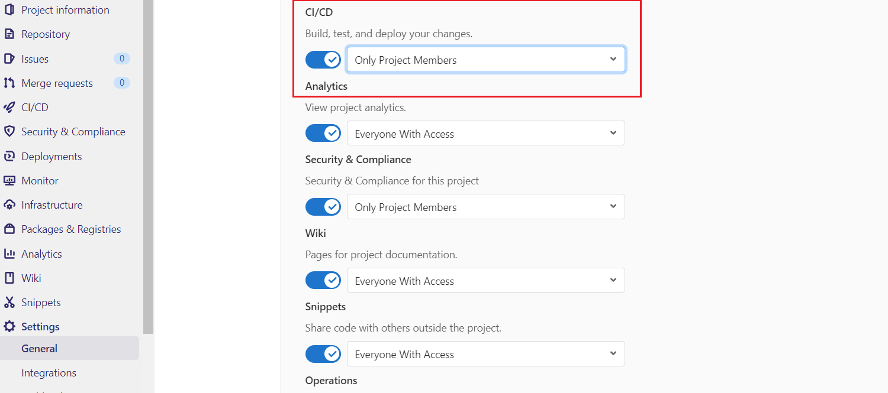

## Gitlab CI/CD

Go to **Settings > Expand Visibility, project features, permissions > Enable CI/CD**

**Note-** CI/CD Runner only work with **Internal/Public** projects

### Make Project Internal/Public

Go to **Setting > Expand Visibility, project features, permissions > Make Project Internal**

Make Sure that if there is any parent repository or main repository available also make that repository Internal/Public

**Now you can see CI/CD Tab on side-navigation bar**

### How to add CI/CD variables in your pipeline

Go to **Setting > CI/CD Settings > Expand Variables > Add Variable**

**Note** - For add SSH KEY . just change variable Type to File

## Make .gitlab-ci.yml file in your repository

### For API

Use [Gitlab CI Templates](https://gitlab.orderhive.plus/public-resources/gitlab-ci/-/blob/master/templates) for your reference

We will learn each stage one by one :

#### get_env

Use this stage/job if you .env file is coming from s3 bucket

For this stage, first you have to setup ci/cd variables for Access Key and Secret Key 

